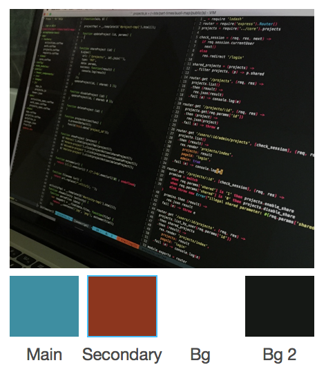
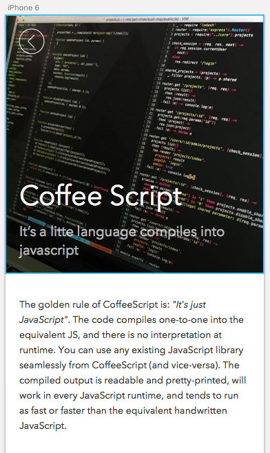
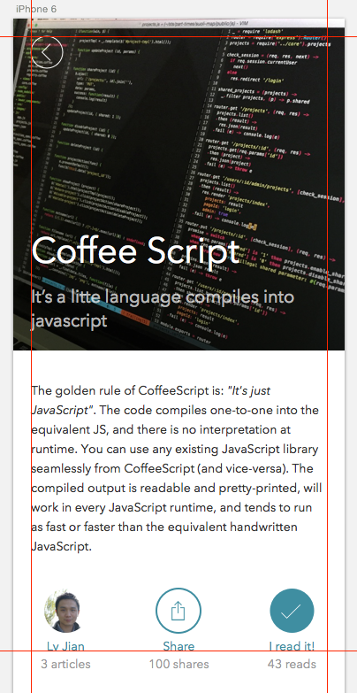
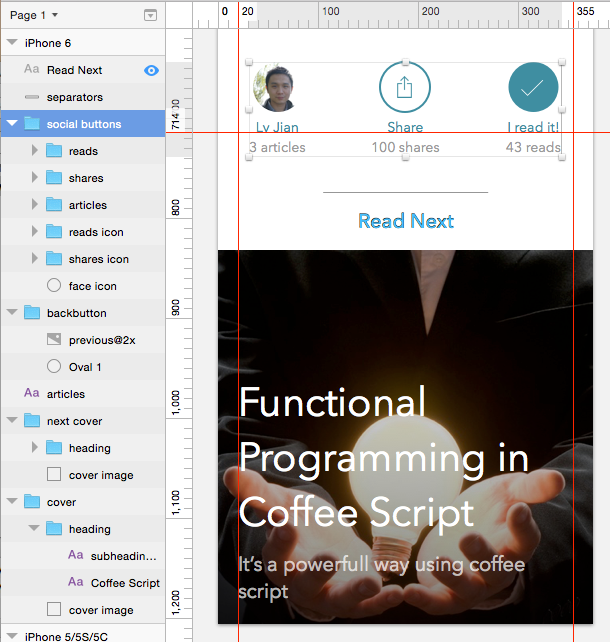

##挑选颜色

* Main color: 通常用于吸引用户注意, 比如按钮，提醒操作时使用
* Secondary color: 辅助main color增加一些颜色变化
* Background color: 用于辅助内容现实
* Background contrasted color: 和Background color配合凸现内容

##选择字体和字号

* Font: Avenir Next
* Heading: Regular 40px #fff
* Sub Heading: Regular 20px #fff Opacity: 70%
* body: Regular 14px #333333

##排版

* Margin
* Align
* ....

##元素分组

元素分组如同代码重构，让每个元素所在layer变得更有描述意义.

##参考

* Color template: <http://www.rocket-design.fr/color-template/>
* A pocket guid to master typograhic Adventures <http://www.typogui.de/>
* Pixel Love Icons: <http://www.pixellove.com/>
