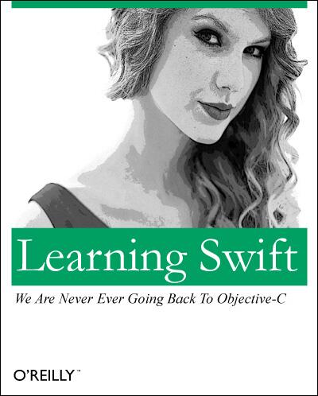

 

在 [WWDC 2014](http://www.apple.com/apple-events/june-2014/) 上 Apple `Duang!!!` 一声发布了 [Swift](https://swift.org/)。在那次发布会上， Apple 向外界宣布了，自己其实是一家软件公司。

2015 年， Apple 又 `Duang!!!` 一声将 Swift 开源。这让 Swift 迅速攻占了服务器，这使 Swift 开发 Backend server 成为了可能（ [Vapor](https://github.com/vapor/vapor) ）。

初次接触 Swift，让我看到了 Scala、C#、ES 6 的影子，并且语法层面兼容 Objective C。first-class functions 特性让语言并不局限于 OO，让 Swift 具有函数式编程语言的表达力。 同时，Swift 作者 [Chris Lattner](https://en.wikipedia.org/wiki/Chris_Lattner) 这位传奇人物的存在，让 Swift 成为值得长期投资的一门语言。

本文来自 [Swift Tour](https://developer.apple.com/library/content/documentation/Swift/Conceptual/Swift_Programming_Language/GuidedTour.html)，将其中的内容归类总结，可以当做 Cheatsheet 翻阅，对于具有经验的开发者，看过这篇便可开始工作了。

## 变量

Swift 中可以使用 `var` 和 `let` 直接定义 `变量` 或  `常量`。

__定义变量：__
​    

```
var age = 20// 定义变量
let name = "Halo" // 定义常亮
age = 21
```

**声明类型：**

上段代码看起来有些类似 javascript 若类型语言的特性，Swift 本质上还是强类型的语言，声明变量的时候，可以指定数据类型：

```swift
let cash: Float = 1.25
let money: Double = 1.252525
let dollar: String = "USD"
```

## 使用 String

对于字符串，Swift 简化了 Objective C NSString 的定义方式：`@""`：

```swift
let currencies = "AUD, " + dollar
let rmb = "1 \(dollar) is 6 RMB"
let formattedString = String(format: "%.2f \(dollar) is about 600 RMB", 100.0) // 100.00 USD is about 600 RMB
```

`\(variable)` 是 Swift 为字符串模板提供的支持。不过 Swift 还是支持类似 ES 6 或者 Ruby 中多行字符串模板。多行字符串还是需要 `+` 号拼接：

```swift
let introduceSwift = "We are excited by this new chapter in the story of Swift. " +
    "After Apple unveiled the Swift programming language, it quickly became one of " +
    "the fastest growing languages in history. Swift makes it easy to write software " +
    "that is incredibly fast and safe by design. Now that Swift is open source, you can " +
    "help make the best general purpose programming language available everywhere."
```

## 使用 tuple

`tuple` 是 Swift 引入的一种新的数据类型，它可以方便支持方法的多返回值：

```swift
let numbersTuple = (1, 100, 1000)
    print("min: \(numbersTuple.0), max: \(numbersTuple.1), sum: \(numbersTuple.2)")

let numbersNamedTuple = (min: 1, max: 100, sum: 1000)
    print("min: \(numbersNamedTuple.0), max: \(numbersNamedTuple.1), sum: \(numbersNamedTuple.2)")
    print("min: \(numbersNamedTuple.min), max: \(numbersNamedTuple.max), sum: \(numbersNamedTuple.sum)")
```

## Collections

**创建集合：**

Swift 的集合类型主要还是 `Array` 和 `Dictionary`：

```swift
var fruits = ["apple", "banana", "oranage"]
var fruitsPrice = [
    "apple": 4.25,
    "banana": 6.2
]
print(fruitsPrice[fruits[1]]) // 6.2
```

**定义空集合：**    

```swift
var emptyArray = [String]()
var emptyDictionary = [String: Float]()
```

将已有集合设置为空时，可以用如下简写：

```swift
fruits = []
fruitsPrice = [:]
```

**使用 for in 遍历集合：**

```swift
for score in [1,2,3,4,5,6] {
    print(score * score * score)
}

for (key, val) in ["one": 1, "two": 2] {
    print("\(val) is \(key)")
}
```

## if else 和 Optional

Swift 中新增一种类型 Optional，这个概念来自 Scala。 Optional 类似一个包装器，它可以包装一个数值，但是 Optional 可能返回 `nil`，可能返回数据。多用于错误处理，通常跟 `if else` 连用：

**声明 Optional：**

```swift
var optionalString: String? = nil
//print(optionalString!) // nil 取值会报错
print(optionalString == nil)

var optionalName: String? = "Jian"
print(optionalName!)
```

`String?` 表示一个 `String` 类型的 Optional。只有 Optional 可以接受 `nil` 值。如果对一个 `nil` 的 Optional 取值会报错，一般取值前会对 Optional 做判断：

```swift
var optionalString: String? = nil

if optionalString != nil {
    let val = optionalString!
} else {
    print("There is no value")
}
```

**if-else 简化 Optional 取值：**

Swift 为上面这种方式提供一种简写：

```swift
if let val = optionalString {
    print("There is a value: \(val)")
} else {
    print("There is no value")
}
```

通常会将 if-else 和 Optional 这么使用：

```swift
var optionalName: String? = "Jian"
print(optionalName!)

var greeting = "Hello!"

if let name = optionalName {
    greeting = "Hello \(name)"
}
```

**Optional 默认值:**

使用 `??` 可以为 Optional 提供默认值：

```swift
let fullName: String = "Jian"
let nickName: String? = nil
let displayName = "\(nickName ?? fullName)"
```

## switch

Swift 中的 switch 强大很多，支持 String，多值匹配，条件匹配：

```swift
let vegetable = "red pepper"

switch vegetable {
case "celery":
    print("Add some raisins and make ants on a log.")
case "cucumber", "watercress":
    print("Taht would make a good tea sandwich.")
case let x where x.hasSuffix("pepper"):
    print("Is it a spicy \(x)?") // Is it a spicy red pepper?
default:
    print("Everythink tasts good")
}
```

## 使用循环

**for in 循环**

Swift 中的 for in 和 javascript 中的有点类似。使用 for in 便利 Dictionary：

```swift
let numbersDict = [
    "Prime": [2, 3, 5, 7, 11, 13],
    "Fibonacci": [1, 1, 2, 3, 5, 8],
    "Square": [1, 4, 9, 16, 25]
]

var largest = 0

for (kind, numbers) in numbersDict {
    for number in numbers {
        number
        if number > largest {
            largest = number
        }
    }
}
print(largest) // 25
```

**使用 for in 遍历 Range：**

```swift
var total = 0
for i in 0..<4 {
    total += i
}
print(total) // 6
```

**while 循环**

一般语言都会提供 `while` 和 `do {} while` 循环。Swift 采用 `while` 和 `repeat {} while`：

```swift
var n = 1
while n < 100 {
    n += n
}
print(n) //128

var m = 1
repeat {
    m += m
} while m < 100
print(m) // 128
```


## Functions

Swift 中的函数具有 javascript 和 objective c 的双重特征。并且函数在 Swift 中是一等公民(First-class type)，具有高阶函数的特性。

**定义函数**

一般情况下，跟 Objective C 方法一样，需要给函数参数提供 Label：

```swift
func greet(person: String, day: String) -> String {
    return "Hello \(person), today is \(day)."
}
greet(person: "Jian", day: "Friday")
```

使用 `_` 表示省略 Label：   

```swift
func greet(_ person: String, on day: String) -> String {
    return "Hello \(person), today is \(day)."
}
greet("Jian", on: "Friday")
```

函数可以使用 `tuple` 返回多个值：

```swift
func calcStatistics(scores: [Int]) -> (min: Int, max: Int, sum: Int) {
    var min = scores[0]
    var max = scores[0]
    var sum = 0
    
    for score in scores {
        if score > max {
            max = score
        } else if score < min {
            min = score
        }
        
        sum += score
    }
    
    return (min, max, sum)
}

let statistics = calcStatistics(scores: [5, 1, 100, 30, 90])
print(statistics.sum) // 226
print(statistics.2)   // 226
```

无限参数：  

```swift
func sumOf(numbers: Int...) -> Int {
    return numbers.reduce(0, +)
}
sumOf()                             // 0
sumOf(numbers: 1, 2, 3, 4, 10)      // 20
```

使用 `Int...` 在函数的最后一个参数，表示后面可以接受无限个整数参数。    

**函数嵌套**

```swift
func returnFifteen() -> Int {
    var y = 10
    func add() { y += 5 }
    add()
    return y
}
returnFifteen() // 15
```

**高阶函数**

高阶函数([high-order function](https://en.wikipedia.org/wiki/Higher-order_function))，是函数是编程的一个概念，高阶函数的特点：

* 可以将函数当做返回值，即：可以使用函数创建函数
* 可以将函数当做参数接收

使用函数创建另一个函数：

```swift
func createIncrementer() -> ((Int) -> Int) {
    func plusOne(number: Int) -> Int {
        return 1 + number
    }
    
    return plusOne
}
let incrementer = createIncrementer()
incrementer(10)
```

函数作为参数：  

```swift
func hasAnyMatches(_ list: [Int], matcher: (Int) -> Bool) -> Bool {
    for item in list {
        if matcher(item) {
            return true
        }
    }
    
    return false
}

func lessThanThen(number: Int) -> Bool {
    return number < 10
}

hasAnyMatches([20, 10, 7, 12], matcher: lessThanThen)
```

## Closure （闭包）

Closure 可以理解匿名函数，在很多 Callback 和集合操作中使用：

```swift
hasAnyMatches([20, 10, 7, 12]) { (item: Int) -> Bool in
    item < 10
}
[20, 10, 7, 12].map { (item: Int) -> Int in
    return 3 * item
}
[20, 10, 7, 12].map({ item in 3 * item })
```

如果省略 `()` 后， Closure 是唯一的参数：   

```swift
let sortedNumbers = [20, 10, 7, 12].sorted { $0 > $1 }
print(sortedNumbers)
```

## Objects and Classes

定义和使用类：

```swift
class Shape {
    var numberOfSides = 0
    
    func simpleDescription() -> String {
        return "A shap with \(numberOfSides) sides."
    }
}
let shape = Shape()
shape.numberOfSides = 10
shape.simpleDescription()
```

使用继承:

```swift
class NamedShape : Shape {
    var name: String
    
    init(name: String) {
        self.name = name
    }
}

// inherit and override
class Square: NamedShape {
    var sideLength: Double
    
    init(sideLength: Double, name: String) {
        self.sideLength = sideLength
        super.init(name: name)
        numberOfSides = 4
    }
    
    func area() -> Double {
        return sideLength * sideLength
    }
    
    override func simpleDescription() -> String {
        return "A square with sides of length \(sideLength)"
    }
}

let square = Square(sideLength: 10.0, name: "Jian's Square")
square.area()
square.simpleDescription()
```

**使用属性**

Swift 中对属性的处理，有些像 C#。

使用 getter/setter

```swift
class EquilateralTriangle: NamedShape {
    var sideLength: Double = 0.0
    
    init(sideLength: Double, name: String) {
        self.sideLength = sideLength
        super.init(name: name)
        numberOfSides = 3
    }
    
    var perimeter: Double {
        get {
            return 3.0 * sideLength
        }
        set {
            sideLength = newValue / 3.0
        }
    }
    
    override func simpleDescription() -> String {
        return "An equilateral triangle with sides of length \(sideLength)"
    }
}
var triangle = EquilateralTriangle(sideLength: 3.1, name: "A triangle")
print(triangle.perimeter)           // 9.3

triangle.perimeter = 9.9
print(triangle.sideLength)          // 3.3
```

使用 willSet：  

```swift
class TriangleAndSquare {
    var triangle: EquilateralTriangle {
        willSet {
            square.sideLength = newValue.sideLength
        }
    }
    
    var square: Square {
        willSet {
            triangle.sideLength = newValue.sideLength
        }
    }
    
    init(size: Double, name: String) {
        square = Square(sideLength: size, name: name)
        triangle = EquilateralTriangle(sideLength: size, name: name)
    }
}

var triangleAndSquare = TriangleAndSquare(size: 10, name: "other shape")
print(triangleAndSquare.square.sideLength)          // 10.0
print(triangleAndSquare.triangle.sideLength)        // 10.0

triangleAndSquare.square = Square(sideLength: 50, name: "Large square")
print(triangleAndSquare.triangle.sideLength)        // 50.0
```

使用 `willSet` 保证 `square` 和 `triangle` 的 `sideLength` 始终相等。   

**使用 Optional 类型**

使用 `?.` 取值，当值为 `nil` 时返回 `nil`，而不是报错。 

```swift
let optionalSquare: Square? = Square(sideLength: 2.5, name: "optional square")
let sideLength = optionalSquare?.sideLength
let nilSquare: Square? = nil
let nilLength = nilSquare?.sideLength
```

## Enumerations

定义 `enum` 类型：

```swift
enum Level: Int {
    case Zero, First, Second
}
Level.Zero.rawValue
Level.First.rawValue
```

`enum` 的 `rawValue` 默认从 `0` 开始，依次递增。

在 enum 中创建方法：

```swift
enum Suit {
    case spades, hearts, diamonds, clubs
    func simpleDescription() -> String {
        switch self {
        case .spades:
            return "spades"
        case .hearts:
            return "hearts"
        case .diamonds:
            return "diamonds"
        case .clubs:
            return "clubs"
        }
    }
}
```

定义特性类型的 enum：

```swift
enum Rank: Int {
    case ace = 1
    case two, three, four, five, six, seven, eight, nine, ten
    case jack, queen, king
    
    func simpleDescription() -> String {
        switch self {
        case .ace:
            return "ace"
        case .jack:
            return "jack"
        case .queen:
            return "queen"
        case .king:
            return "king"
        default:
            return String(self.rawValue)
        }
    }
}
let ace = Rank.ace                      // ace
let aceRawValue = ace.rawValue          // 1
```

`enum Rank: Int` 设置 `enum` 的 `rawValue` 为 `Int`。我们也可以通过 `rawValue` 来创建 `enum`：

```swift
if let convertedRank = Rank(rawValue: 3) {
    let threeDescription = convertedRank.simpleDescription()        // 3
}
```

复杂的 `enum`：

```swift
enum ServerResponse {
    case result(String, String)
    case failure(String)
}

let success = ServerResponse.result("6:00 am", "8:00 pm")
let failure = ServerResponse.failure("Out of cheese")

switch success {
case let .result(sunrise, sunset):
    print("Sunrise is at \(sunrise) and sunset is at \(sunset)") // Sunrise is at 6:00 am and sunset is at 8:00 pm
case let .failure(message):
    print("Failure ... \(message)")
}
```

## Structs

```swift
struct Card {
    var rank: Rank
    var suit: Suit
    
    func simpleDescript() -> String {
        return "The \(rank.simpleDescription()) of \(suit.simpleDescription())"
    }
}
let threeOfSpades = Card(rank: .three, suit: .spades)   // Card
print(threeOfSpades.simpleDescript())                   // The 3 of spades
```

`struct` 和 `class` 最重要的区别是：

* `struct` 传递值，始终传递 copy
* `class` 传递引用。

## Protocol

```swift
protocol ExampleProtocol {
    var simpleDescription: String { get }
    mutating func adjust()
}
```

Protocol 与 Java 中的 Interface 概念类似。在 Swift 中，class、struct、enum、extension 都可以实现 Protocol：

class 实现 protocol：   

```swift
class SimpleClass: ExampleProtocol {
    var simpleDescription: String = "A simple class."
    var moreProperty: Int = 315
    func adjust() {
        simpleDescription += " Now 100% adjusted"
    }
}
var simpleClass = SimpleClass()
simpleClass.adjust()
print(simpleClass.simpleDescription)        // A simple class. Now 100% adjusted
```

struct 实现 protocol：  

```swift
struct SimpleStructure: ExampleProtocol {
    var simpleDescription: String = "A simple structure"
    mutating func adjust() {
        simpleDescription += " (adjusted) "
    }
}

var simpleStruct = SimpleStructure()
simpleStruct.adjust()
print(simpleStruct.simpleDescription)
```

`mutating` 修饰符表示，当前方法在 `struct` 中可以修改 struct 的值。

在 protocol 的应用中，可以使用 Java 中面向 Interface 编程：

```swift
let protocolValue: ExampleProtocol = simpleStruct
print(protocolValue.simpleDescription)              // A simple structure (adjusted)
```


## Extensions

Swift 中的 `extension` 和 ruby 中的 Open Class 概念很像，在 ObjC 中是 `Category`。它可以为已有类型添加新的特性：

```swift
extension Int: ExampleProtocol {
    var simpleDescription: String {
        return "The number \(self)"
    }
    
    mutating func adjust() {
        self += 10
    }
}

print(7.simpleDescription)
```

## Error Handling

**throws 异常**

```swift
enum PointerError: Error {
    case outOfPaper
    case noToner
    case onFire
}

// throw error
func send(job: Int, toPointer printerName: String) throws -> String {
    if printerName == "Never has toner" {
        throw PointerError.noToner
    }
    return "Job sent"
}
```

**catch 和处理异常**

对于具有 `throws` 声明的方法，需要使用 `try` 关键字调用，然后使用 `do {} catch {}` 包裹：

```
do {
    let pointerResp = try send(job: 1024, toPointer: "Never has toner")
    print(pointerResp)
} catch { // catch all errors
    print(error) // use error by default
}
```

处理多个异常：

```swift
do {
    let pointerResponse = try send(job: 1024, toPointer: "Jian")
    print(pointerResponse)
    throw PointerError.onFire
    
} catch PointerError.onFire {
    print("I'll just put shi over here, with the result of the fire.")      // I'll just put shi over here, with the result of the fire.
} catch let pointerError as PointerError {
    print("Printer error: \(pointerError) .")
} catch {
    print(error)
}
```

通常 `catch` 多个 Error 时，`catch` 顺序需要从小异常，到范围更大的异常。

**使用 try?**

```swift
// try? -> Optional
let pointerFailure = try? send(job: 1024, toPointer: "Never has toner")         // nil
let pointerSuccess = try? send(job: 2048, toPointer: "Good pointer")        // Job sent
```

**使用 defer**

在方法 throws 时，会终端当前函数后续的代码执行，使用 `defer` 可以确保 `defer` 代码段中的代码在函数返回前始终被执行。这个概念有些像 Java 的 `try {} catch {} finally {}` 中的 `finally`：    

```swift
func ensureExecute() throws -> String {
    defer {
        print("Complete")
    }
    
    do {
        try send(job: 1024, toPointer: "Never has toner")
    } catch {
        throw error
    }
    
    return "Executed"
}
let executed = try? ensureExecute()     // Complete
```

## Generic

Swift 开始支持泛型（Generic）：

```swift
enum OptionalValue<Wrapped> {
    case none
    case some(Wrapped)
}
var possibleInteger: OptionalValue<Int> = .none     // none
possibleInteger = .some(100)                        // some(100)
```

使用 `where` 限定泛型的类型：

```swift
func anyCommonElements<T: Sequence, U: Sequence>(_ lhs: T, _ rhs: U) -> Bool
    where T.Iterator.Element: Equatable, T.Iterator.Element == U.Iterator.Element {
        
        for lhsItem in lhs {
            for rhsItem in rhs {
                if lhsItem == rhsItem {
                    return true
                }
            }
        }

        return false
}
anyCommonElements([1,2,3,4,5], [5])
```

`where T.Iterator.Element: Equatable, T.Iterator.Element == U.Iterator.Element` 限制 `T` 和 `U` 中的元素，必须实现 `Equatable`，并且 `T` 和 `U` 中的元素是同一种类型。


## 扩展阅读

* [《iOS Language Guide》](https://developer.apple.com/library/content/documentation/Swift/Conceptual/Swift_Programming_Language/TheBasics.html#//apple_ref/doc/uid/TP40014097-CH5-ID309)
* [《Swift Apprentice》 - $55](https://store.raywenderlich.com/products/swift-apprentice?_ga=1.99874974.1055804196.1474619036)
* [《Functional Swift》 - $39 - eBook](https://www.objc.io/books/functional-swift/)
