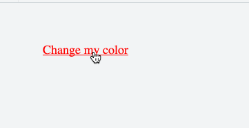
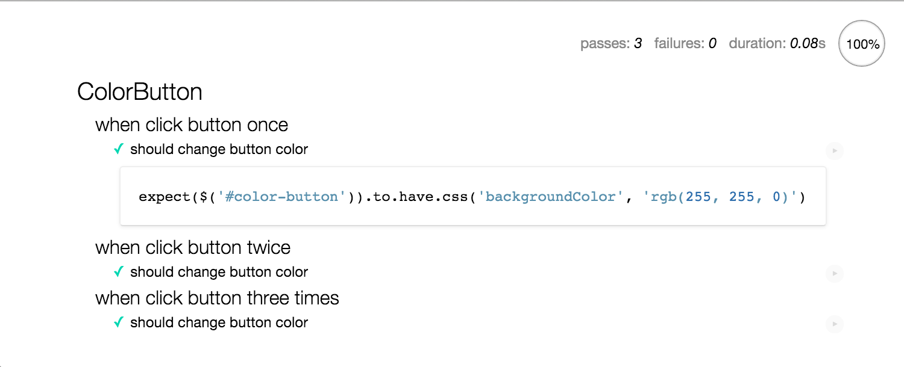

#为 jQuery 编写 plugin

jQuery 已经是现在 Front-End 开发必备工具，本文将介绍如何为 jQuery 编写一个 `ColorButton` plugin。 

内容将涉及:  

* jQuery plugin 基本结构
* 编写一个简单的 plugin
* 引入封装，完成 `ColorButton`
* 为 plugin 编写 Unit Test

##编写 jQuery 基本结构

1. 创建 `plugin` 代码
2. 为 `plugin` 添加方法
3. 将 `plugin` 注册到 jQuery

```
(function($) {

  // 1. 创建 `plugin` 代码
  var ColorButton = function($select, options) {
    // 初始化
    this.$el = $select
    this.settings = $.extend({
      // 默认参数
    }, options || {});

    // binding 事件
  };

  // 2. 为 `plugin` 添加方法
  $.extend(ColorButton.prototype, {
    // 这里定义方法
  });

  // 3. 将 `plugin` 绑定到 jQuery
  $.fn.colorbutton = function(options) {
    return this.each(function() {
      var $select = $(this)
      if (!$select.data('colorbutton')) {
        $select.data('colorbutton', new ColorButton($select, options));
      }
    });
  };

})(jQuery);

// 使用
$('.color-button').colorbutton();
```

JSFildder 代码: <https://jsfiddle.net/lvjian700/kn6qvmcz/1/>

##编写一个简单的 plugin

这里按照上述模板代码做一个最小的插件。  

1. 将 `ColorButton` 绑定到 button 上
2. 当点击 button 时，在控制台输出 `clicked` 

```
  // 1. 创建 plugin 代码
  var ColorButton = function($select, options) {
    // 组建初始化代码
    this.$el = $select
    this.settings = $.extend({
      // 默认参数
    }, options || {});

    // binding 事件
    this.$el.click(function() {
      console.log('clicked');
    });
  };
```

JSFildder 上的完整代码：<https://jsfiddle.net/lvjian700/kn6qvmcz/2/>

##引入封装，完成 ColorButton

上篇我们在 `plugin` 初始化时进行了事件绑定。现在我们实现 `ColorButton` 的功能。当用户点击 `ColorButton` 时改变 button 的背景色。    

	

步骤:   

1. 接收参数，提供 colors 选项，并且为 colors 提供默认参数
2. 提供 `getColor` 方法提供当前的背景色
3. 提供 `changeColor` 方法改变颜色
4. 将 `changeColor` 班定到 `click` 事件

```
  var ColorButton = function($select, options) {
    this.$el = $select;
    this.colorIndex = 0;

    // 1. 接收参数，提供 colors 选项，并且为 colors 提供默认参数
    this.settings = $.extend({
      colors: ['#ff0', '#f0f', '#0ff']
    }, options || {});

    var that = this;
    this.$el.click(function(e) {
      e.preventDefault();
      // 4. 将 changeColor 班定到 click 事件
      that.changeColor();
    });
  };

  $.extend(ColorButton.prototype, {
    // 3. 提供 changeColor 方法改变颜色
    changeColor: function() {
      this.$el.css({ backgroundColor: this.getColor() });
    },
    // 2. 提供 getColor 方法提供当前的背景色
    getColor: function() {
      var currentIndex = this.colorIndex;
      this.colorIndex = (this.colorIndex + 1) % this.settings.colors.length;

      return this.settings.colors[currentIndex];
    }
  });
```

JSFildder 上的完整代码：<https://jsfiddle.net/lvjian700/kn6qvmcz/3/>

##为 plugin 编写 Unit Test

Web 开发中我们一般使用 `Cucumber` 和 `Capybara` 对 UI 进行测试。这个层级的测试属于 `UI Automattion Test`，也可成为 `Acceptance Test`。这类测试运行成本比较高。

所以这里采用 Unit Test`方式对 plugin 进行测试。		


	
工具:	

* [mocha](https://mochajs.org/)：提供类 RSpec 风格的 Test Case
* [chai](http://chaijs.com/)： 提供 assertion 和 matcher
* [chai-jquery](https://github.com/chaijs/chai-jquery)：提供更好用的 assertion

更好的工具，但是本文没有使用：

* [karma](https://karma-runner.github.io/0.13/index.html)：当然我们可以使用 karma 在命令行中运行测试，本文暂时没有使用
* [sinon](sinonjs.org)：可以做 `sub`、`mock`、`spy`, `mock network`


如果你用的 Rails，可以使用 [teaspoon](https://github.com/modeset/teaspoon) 来运行测试。	

编写测试的基本结构：	

```
  describe('ColorButton', function () {

    beforeEach(function() {
		// 加载 fixture
		// 初始化 plugin
    });

    afterEach(function() {
		// remove fixture
    });

    describe('描述 Context', function() {
	  beforeEach(function() {
        // 准备 Context
      });
      it('assertion 描述', function() {
		// 我们期待 ...
      });
    });
    
	// 更多 Context ...
  });
```

对 `ColorButton` 的测试：	

```
  describe('ColorButton', function () {

    beforeEach(function() {
      $('body').append('<a id="color-button" href="#">Button</a>');
      $('#color-button').colorbutton({
        colors: ['#ff0', '#f0f']
      });
    });

    afterEach(function() {
      $('#color-button').remove();
    });

    describe('when click button once', function() {
      beforeEach(function() {
        $('#color-button').click();
      });

      it('should change button color', function() {
        expect($('#color-button')).to.have.css('backgroundColor', 'rgb(255, 255, 0)')
      });
    });
    
	// 更多 Context ...
  });    
```

完整的代码：<https://github.com/lvjian700/color-button>，参考 readme 即可运行测试。	

##总结

如果你的项目只想用简单的 jQuery 并不想使用类似 `BackBone`、`Angular.js`、`React.js` 的框架，使用 jQuery plugin 模块化 UI 组建也是一个不错的选择。	


