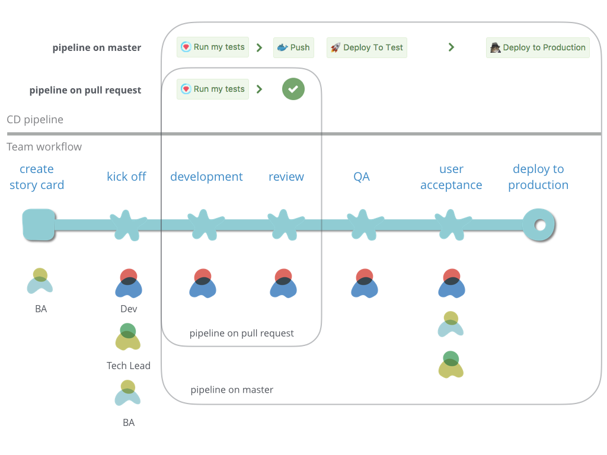

当我们讨论 [Microservice 架构](https://martinfowler.com/articles/microservices.html)时，我们通常会和 [Monolithic 架构](http://microservices.io/patterns/monolithic.html)（单体架构 ） 构进行比较。  


Monolithic 架构中，一个简单的应用会随着功能的增加、时间的推移变得越来越庞大。当 Monoltithic App 变成一个庞然大物，以至于没有人能够完全理解它究竟做了什么。此时无论是添加新功能，还是修复 Bug 都是一个非常痛苦、异常耗时的过程。

Microservice 架构渐渐被许多公司采用（[Amazon](http://highscalability.com/blog/2007/9/18/amazon-architecture.html)、[eBay](https://www.slideshare.net/kasun04/microservices-at-ebay)、[Netflix](https://www.nginx.com/blog/microservices-at-netflix-architectural-best-practices/)），用于解决 Monolithic 架构带来的问题。其思路是将应用分解为小的，可以相互组合的 micro services。 这些 services 通过轻量级的机制进行交互，通常会采用基于 HTTP API。

每个 micro service 完成一个[独立的业务逻辑](https://www.infoq.com/minibooks/domain-driven-design-quickly)，它可以是一个 HTTP API service，它提供给其他 service 或者客户端使用。它也可以是一个 [ETL service](https://en.wikipedia.org/wiki/Extract,_transform,_load)，完成数据迁移工作。每个 micro service 除了在业务上的独立性外，它也会有自己独立的运行环境，独立的开发、部署流程。

这种独立性对 service 部署，Ops 带来很大的挑战。因此持续部署（Continuous Deployment）是 microservice 场景下一个重要的技术实践之一。本文将介绍持续部署 Microservice 的实践和准则：

实践：

1. 使用 Docker 容器化服务
2. 采用 Docker Compose 运行测试

准则：

1. 构建适合团队的持续部署流水线 
2. 版本化一切
3. 容器化一切

##使用 Docker 容器化 service

__我们在构建和发布服务的时候，不仅要发布 service 本身，还需要为 service 配置服务器环境。__ [Dockerize service](https://docs.docker.com/engine/examples/)（即，使用 Docker 容器化我们的 service）可以让我们不仅发布 service，还可以发布 service 需要的运行环境。Dockerize 之后我们可以基于 Docker 构建我们的 CD pipeline（持续部署流水线，简称：CD pipeline）：


上图描述了一个基于 [Ruby on Rails](http://rubyonrails.org/) (简称：Rails)  service 的 CD pipeline。我们用 [Dockerfile](https://docs.docker.com/engine/reference/builder/) 配置 Rails 项目运行所需的环境，并将 Dockerfile 和项目同时放在 git repository 中进行版本管理。下面 Dockerfile 可以描述一个 Rails 项目的基础环境：

```Dockerfile
FROM ruby:2.3.3
RUN apt-get update -y && \
    apt-get install -y libpq-dev nodejs git
WORKDIR /app
ADD Gemfile /app/Gemfile
ADD Gemfile.lock /app/Gemfile.lock
RUN bundle install --jobs 8 --retry 3
ADD . /app
EXPOSE 80
CMD ["bin/run"]
```

__在持续集成服务器上__会将项目代码和 Dockerfile 同时 clone 下来进行构建(Build Image)、单元测试(Testing)、最终发布(Publish)。此时整个构建过程都基于 Docker 进行，并且构建结果为 [Docker Image](https://docs.docker.com/engine/getstarted/step_four/)，并且最终发布到 [Docker Registry](https://docs.docker.com/registry/)。

__在部署阶段__，部署机器只需要配置 Docker 环境，从 Docker Registry 上 Pull Image 进行部署。
在 service 容器化之后，我们可以让整套 CD pipeline 只依赖 Docker，并不需要为环境各异的 service 进行单独配置。

## 使用 Docker Compose 运行测试

在整个 CD pipeline 中，我们需要在持续集成（Continuous Integration，简称：CI）服务器上部署服务、运行 Unit Test 和 Integration Test。Docker Compose 为我们提供了很好的解决方案。

[Docker Compose](https://docs.docker.com/compose/) 可以将多个 Docker image 进行组合。在 service 需要访问数据库时，我们可以通过 Docker Compose 将 service image 和 database image 组合在一起，然后使用 Docker Compose 在 CI 机器上进行部署并运行测试。


上图描述了 Rails service 和 postgres 数据库的组装过程。我们只需在项目中额外添加一个 [docker-compose.yml](https://docs.docker.com/compose/compose-file/) 来描述组装过程：

```yaml
db:
  image: postgres:9.4
  ports:
    - "5432"
service:
  build: .
  command: ./bin/run
  volumes:
    - .:/app
  ports:
    - "3000:3000"
dev:
  extends:
    file: docker-compose.yml
    service: service
  links:
    - db
  environment:
    - RAILS_ENV=development
ci:
  extends:
    file: docker-compose.yml
    service: service
  links:
    - db
  environment:
    - RAILS_ENV=test
```

采用 Docker Compose 运行 Unit Test 和 Integration Test：

```bash
docker-compose run -rm ci bundle exec rake
```

## 构建适合团队的持续部署流水线

当我们的代码 push 提交的代码仓库中后， CD pipeline 应该能够对 service 进行构建，测试，并最终部署到生产环境。

为了让 CD pipeline 更好的服务团队，我们通常会对 CD pipeline 做一些调整，使其更好的服务团队的工作流程。例如下图所示的，一个敏捷团队的工作流程：


通常团队会有 BA 做需求分析，BA 将需求转换成适合工作的 [Story Card](http://www.agilemodeling.com/artifacts/userStory.htm)。Developer (简称：Dev ) 在拿到新卡的时候会先做分析，之后和 BA、Tech Lead __kick off 需求和技术实现方案__。

Dev 在开发阶段会__在 branch 上进行开发__，采用 [Pull Request](https://help.github.com/articles/about-pull-requests/) 的方式提交代码，并且邀请__他人进行 Review__。在 Pull Request 被 Review 通过之后，branch 会被 merge 到 master，此时代码会被__自动部署到 test 环境__。

在 microservices 场景下，本地很难搭建一整套集成环境，通常 test 环境具有完成的集成环境，在部署到 test 环境之后，QA 会在 test 环境上进行测试。

QA 完成后，QA 会跟 BA、Tech Lead 进行 [User Acceptance Test](https://en.wikipedia.org/wiki/Acceptance_testing)，确认需求的实现和技术实现方案，进行验收测试。验收后的 Story 会被部署到 production 环境。

在上述团队工作的流程下，如果 CD pipeline 仅对 master 分支进行打包、测试、发布。在开发阶段 (即，代码还在 branch) 时，无法从 CI 上得到反馈，直到代码被合并到 master 并运行构建后才能得到反馈，__通常会造成本地测试成功，但是 CI 失败的场景__。

因此，团队对仅基于 master 分支的 CD pipeline 做一些改进。使其可以支持对 Pull Request 代码的构建： 



如上图所示：

* CD Pipeline 区分 Pull Request 和 master。 Pull Request 上只运行单元测试， master 运行完成全部构建并自动将代码部署到 test 环境。
* 为 production 部署引入手动操作，在  User Acceptance Test 完成之后再手动触发 production 部署。 

经过调整后的 CD pipeline 可以团队在开发阶段快速从 CI 上得到反馈，并且对 production 部署有更好的控制。

## 版本化一切

__版本化一切，即将 service 开发部署相关的都系都版本化控制__。我们不仅将项目代码纳入版本管理，而且将项目相关的服务，基础设施都进行版本化管理。

对于一个 service，我们一般会为它单独配置 CD pipeline，为它配置独立的用于运行的基础设施。此时涉及两个非常重要的技术实践：

* Build pipeline as Code
* Infrastructure as Code

__Build pipeline as Code，即：构建流水线即代码__。通常我们使用 [Jenkins](https://jenkins.io/) 或者 [Bamboo](https://www.atlassian.com/software/bamboo) 来搭建配置 CI/CD pipeline，每次创建 pipeline 需要手动配置，这些手动操作不易重用，并且可读性很差，每次对 pipeline 配置的改动并不会保存历史记录，也就是说我们无从追踪配置的改动。

在今年上半年，团队将所有的 CD pipeline 从 Bamboo 迁移到了 [BuildKite](https://buildkite.com/)，BuildKite 对 Build pipeline as Code 有很好的支持。下图描述了 BuildKite 的工作方式：


在 BuildKite 场景下，我们会在每个 service 代码库中新增一个 [pipeline.yml](https://buildkite.com/docs/pipelines/defining-steps) 来描述构建步骤。CI Service 会从项目的 pipeline.yml 中读取配置，生成构建步骤。例如，我们可以使用如下代码描述 pipeline：

```yaml
steps:
  -
    name: "Run my tests"
    command: "shared_ci_script/bin/test"
    agents:
      queue: test
  - wait
  -
    name: "Push docker image"
    command: "shared_ci_script/bin/docker-tag"
    branches: "master"
    agents:
      queue: test
  - wait
  -
    name: "Deploy To Test"
    command: "shared_ci_script/bin/deploy"
    branches: "master"
    env:
      DEPLOYMENT_ENV: test
    agents:
      queue: test
  - block
  - name: "Deploy to Production"
    command: "shared_ci_script/bin/deploy"
    branches: "master"
    env:
      DEPLOYMENT_ENV: prod
    agents:
      queue: production
```

在上述配置中， command 中的步骤 ( 即：test、docker-tag、deploy ) 分别是具体的构建脚本，这些脚本被放在一个公共的 shared_ci_script 代码库中，shared_ci_script 会以 git submodule 的方式被引入到每个 service 代码库中。
经过 Build pipeline as Code 方式的改造，对于 CD pipeline 的任何改动都会在 git 中被追踪，并且有很好的可读性。

__[Infrastructure as Code](https://en.wikipedia.org/wiki/Infrastructure_as_Code)，即：基础设施即代码__。对于一个基于 HTTP 协议的 API service 基础设施可以是:

* 用于部署的机器
* 机器的 IP 和网络配置
* 设备硬件监控服务（CPU，Memory 等）
* 负载均衡（Load Balancer）
* DNS 服务
* AutoScaling Service （services 自动伸缩服务）
* Splunk 日志收集
* NewRelic 性能监控
* Sentry.io 和 PagerDuty 报警

这些基础设施我们可以使用代码进行描述，[AWS Cloudformation](https://aws.amazon.com/cloudformation/) 在这方面提供了很好的支持。我们可以使用 AWS Cloudformation Designer 或者遵循 AWS Cloudformation 的语法配置基础设施。下图为一个 API Service 基础设施构件图，构件图中构建了上面提到的大部分基础设施：


在 AWS Cloudformation 中，基础设施描述代码可以是 json 文件，也可以是 yaml 文件。我们将这些文件也放到项目的代码库中进行版本化管理。

所有对基础设施的操作，我们都通过修改 AWS Cloudformation 配置进行修改，并且所有修改都应该在 git 中。

由于我们采用代码描述基础设施，并且大部分 service 遵循相通的部署流程和基础设施，基础设施代码的相似度很高。 DevOps 团队会为团队创建属于自己的部署工具简化基础设施配置和部署流程。

## 容器化一切

通常在部署 service 时，我们还需要一些服务辅助 service，这些服务我们也将其容器化，并使用 Docker 运行。下图描述了一个 service 在 [AWS EC2 Instance](https://aws.amazon.com/ec2/) 上面的运行环境：


在 service 部署到 AWS EC2 Instance 时，我们需要为日志配置日志收集服务，需要为 service 配置 Nginx 反向代理。

按照 [12-factors](https://12factor.net/zh_cn/) 原则，我们基于 [fluentd](http://www.fluentd.org/)，采用[日志流的方式处理日志](https://12factor.net/zh_cn/logs)。其中 logs-router 用来分发日志、[splunk-forwarder](https://www.splunk.com/en_us/download/universal-forwarder.html) 将日志转发到 [Splunk](https://www.splunk.com/) 。

在容器化一切之后，我们的 service 启动只需要依赖 Docker 环境，相关服务的依赖也可以通过 Docker 的机制进行运行。

## 总结

Microsservices 在业务和技术的扩展性方面带来了极大的便利，同时在组织和技术层面带来的极大的挑战。由于在架构的演进过程中，会有很多新服务产生，持续部署是技术层面的挑战之一，好的持续部署实践和准则可以让团队从基础设施抽离出来，关注与产生业务价值的功能实现。