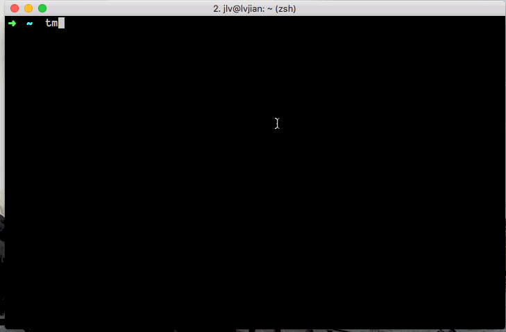

#使用 tmux + teamocil 启动你的 services 

如果你也跟我一样工作在 micro services 架构下，或者你的 App 需要运行很多 services 进行支持，每次起一堆 services 是一个很痛苦的过程。本文将介绍如何使用 tmux + teamocil 一键启动你的 services。   




##Tools

按照如下连接安装工具即可:   

* [tmux](https://tmux.github.io/): 非常强大的 Terminal 环境
* [teamocil](https://github.com/remiprev/teamocil): 一个 Ruby gem，用来管理 windows 和 panels，这个工具是本文的主角

##使用 teamicol 


__1.创建配置文件：__    

```
mkdir ~/.teamocil/
touch ~/.teamocil/project_name.yml

teamocil --edit project_name.yml
```

__Trouble Shooting：__  

在使用 `teamocil --edit project_name.yml` 时，你可能会碰见 Permission 问题。请检查你的 `$EDITOR` 环境变量，如果没有配置，配置成你常用的 editor：    

我配置的是 vim：    

```
export EDITOR=vim
``` 

__2.编辑配置文件：__        

```
windows:
  - name: sample
    root: ~/sts/services
    layout: tiled
    panes:
      - commands:
        - cd service-a
        - echo "start services a ..."
        - pwd
      - commands:
        - cd service-b
        - echo "start services b ..."
        - pwd
```


##运行 teamocil

打开你常用的 Termnial 输入如下指令：    

```
tmux
teamocil project_name
```

此时你便可看到本文开头的 gif 演示。     

在使用 teamocil 时，建议在 bash 中配置自动补全：    

zshrc：

```
compctl -g '~/.teamocil/*(:t:r)' teamocil
```

bash:   

```
complete -W "$(teamocil --list)" teamocil
```

##tmux 小技巧   

如果你是第一次使用 tmux，你可能会跟我一样不知道如何操作 tmux，这里介绍一些小技巧：    

* Panels 间移动：`Ctrl + b  [上下左右键]`
* 回滚和选择日志（ Copy 模式）: `Ctrl + b [`
* 关闭当前 window：`Ctrl + b &`
* 列出当前 sessions：`tmux ls`
* kill session：`tmux kill-session -t {session name}`   

如果你跟我一样喜欢使用 vim 键位，可以将 `Copy 模式` 设置成 vim 键位：   

在 `~/.tmux.conf` 中加入如下配置：  

```
setw -g mode-keys vi
```

