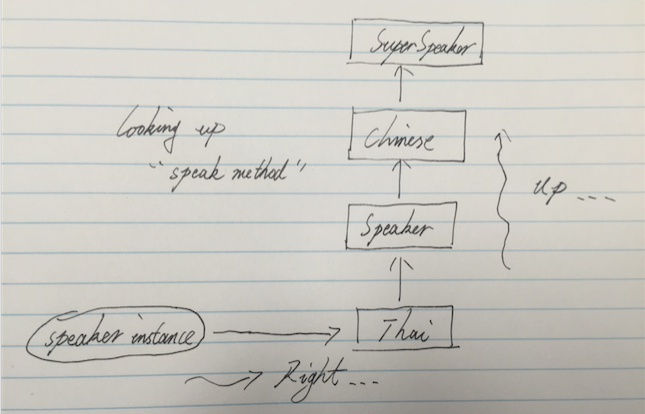
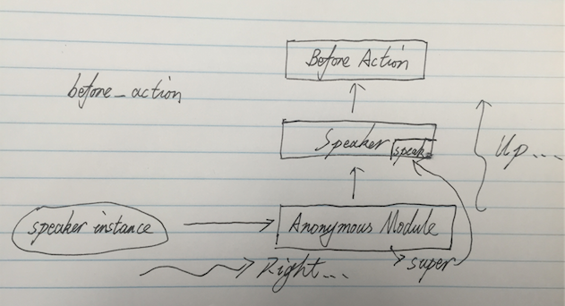

#Ruby 中的 include 和 prepend

Ruby 中使用 `mixin` 优雅的解决了 `multiple inheritance` 问题。在 Java 世界中使用 `interface` 解决这个问题，在 Ruby 中使用 `module`。与 Java 中不同的是，Ruby 中的 `module` 不但可以定义接口，而且还能提供实现。 

在 Ruby 提供 `include` 和 `prepend` 两种方式使用 `module`，而对 `include or prepend module` 这种方式，Ruby 称为 `mixin`。本文将介绍这两种不同的 `mixin` 方式。   

##先认识一下include和prepend

猜一下这段代码的输出: 

```
class SuperSpeaker
  def speak
    puts 'Super class speaking...'
  end
end

module Chinese
  def speak
    puts '在说中文...'
    super
  end
end

module Thai
  def speak
    puts 'ฉันกำลังพูด...'
    super
  end
end

class Speaker < SuperSpeaker
  include Chinese
  prepend Thai

  def speak
    puts 'Subclass speaking...'
    super
  end
end

p Speaker.ancestors
speaker = Speaker.new
speaker.speak
```

这段代码将输出：    

```
[Thai, Speaker, Chinese, SuperSpeaker, Object, Kernel, BasicObject]
ฉันกำลังพูด...
Speaker is speaking...
在说中文...
Super speaker is speaking...
```

通过输出我们可以看到:   

* `include` 会将 `Chinese` module 加入到 `Speaker` 的__后面__
* `prepend` 会将 `Thai` module 加入到 `Speaker` 的__前面__


##从 Ruby 的 Method lookup 机制理解 include 和 prepend

在理解 `include` 和 `prepend` 时，我们需要知道，当我在一个 `instance` 上调用方法是，Ruby 都做了什么？	

1. Ruby 中方法存在 `Class` 中，`instance` 只有变量没有方法。当在 `instance` 上调用方法时，会先从 `instance` 对应的 `Class` 中查找（先向右查找）
2. 当无法在当前 `Class` 找到改方法时，Ruby 会按照继承链向上查找方法（后向上查找）

这个机制在 Ruby 中称为 `Method lookup`，一句话总结`Method lookup`： 

__『先向右，后向上』__  

在上段代码中，我们输出了 `Speaker` 的继承链: 

```
p Speaker.ancestors
# => [Thai, Speaker, Chinese, SuperSpeaker, Object, Kernel, BasicObject]
```

`Method lookup` 过程是这样的：  

	

从 `Method lookup` 角度来解释 `include` 和 `prepend`：  

* `include` 将 `Chinese module` 加入到 `Speaker` 继承链的`上方`
* `prepend` 将 `Tai module` 加入到 `Speaker` 继承链的`下方`

这样也就解释了，为什么 `Speaker#speak` 会先输出泰文：『ฉันกำลังพูด...』。

##使用 `include` 和 `prepend` 实现一个简单的 DSL    

在 `Rails Controller` 中，`before_action` 非常好用，这里我们使用 `include` 和 `prepend` 实现一个简单的 `before_action`：    

```
module BeforeAction
  def self.included(klass)
    klass.extend(ClassMethods)
  end

  module ClassMethods
    def before_action(method_name, options)
      action_module = Module.new do
        send :define_method, options[:for] do |*args, &block|
          send method_name

          super(*args, &block)
        end
      end

      prepend action_module
    end
  end
end

class Speaker
  include BeforeAction

  before_action :chinese_self_intro, for: :speak

  def speak
    puts 'I am speaking...'
  end

  private

  def chinese_self_intro
    puts 'Hello, I come from china.'
  end
end

Speaker.new.speak
```

输出一下`Speaker`的继承链，便于我们理解 `before_action` 的原理：    

```
p action_module.class_methods
#=> [:speak]
p Speaker.ancestors
#=> [#<Module:0x007fe1ca254be0>, Speaker, BeforeAction, Object, Kernel, BasicObject]
```

	

1. 使用 `include` 将 `BeforeAction` mixin 到 `Speaker` 继承链上面，此时在定义 `Speaker` 时便可使用 `before_action`
2. 在 `before_action` 中 `prepend` 将带有 `speak` 方法的 `anonymous module`，将 `anonymous module` 插入到继承链的底端。这样在调用 `Speaker#speak` 时，先调用 `anonymous module` 中的 `speak`
3. 在 `anonymous module` 中的 `speak` 方法调用 `for` 参数指定的 `chinese_self_intro`


##总结

Ruby 中的 `include` 和 `prepend` 为 Ruby 提供了 `mixin` 机制，这个机制不但解决`multiple inheritance` 问题，而且为 Ruby 的 DSL 能力提供了强大的支持。

那么什么使用用 `mixin`，什么时候用 `inheritance`？	

从一个 Java 程序员角度来讲，当你想定义 `interface` 时便可使用 `mixin`。

