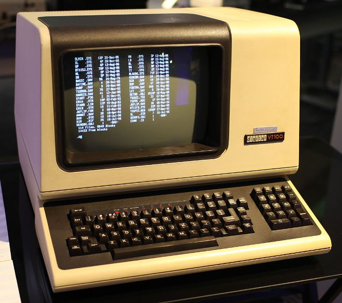

# 设计 Command line Interface 的三个 Pattern



在我们讨论 User Interface 的时候，通常讨论的是 Graph User Interface (GUI)。在我们创建 Command line 工具的时候，好的 User Interface 可以让工具具有很好的用户体验。这种交互方式称为 Command line Interface。比如 `Git` 就是一个非常优秀的 Command line Interface 案例。

本文将介绍设计 Command line Interface 的三个 Pattern。

## 1. Command 名称即功能

这是最简单的一种 Command line，这种 Command line 没有参数，通常名称即 Command 功能。比如 `install.sh`。通常我会用这种方式简化重复的，或者复杂参数的指令。

比如，使用 Docker 启动 mysql 数据库，我会在项目目录下创建一个脚本 `run-mysql`，它需要包含如下内容：

* Command 文件
* 具有可执行权限    

run_mysql.sh:   

```bash
#!/usr/bin/env sh

docker-machine start dev
eval "$(docker-machine env dev)"

docker run --rm -p 3306:3306 --name mysql-5.6 -e MYSQL_ROOT_PASSWORD=root mysql:5.6 --lower-case-table-names=1
```

赋予执行权限：  

```
➜  shell ✗ chmod +x run-mysql.sh
➜  shell ✗ mv run-mysql.sh run-mysql #去掉 .sh 后缀
```

使用:

```bash
➜  shell ✗ ./run-mysql
Starting "dev"...
Machine "dev" is already running.
Initializing database
```

在我们创建 `run-mysql.sh` 时，默认情况下它是没有执行权限的，需要使用 `chmod +x run-mysql.sh` 来赋予执行权限。

## 2. 带参数的 Command

通常 Command 需要接收参数，比如： `curl http://www.google.com/`。这类 Command 会有点复杂度，需要包含如下部分内容：

* 使用说明，说明参数的意义
* 对参数做校验
* 处理参数

例如，我们把上面的脚本做下修改，让他支持 version 这个参数。

```bash
#!/usr/bin/env sh

function usage() {
cat <<EOF
Usage:
    run-mysql <version>

Description:
    Run mysql in docker container with specific version.

EOF
  exit 0
}

if [ $# == 0 ]; then
  usage
fi

MYSQL_VERSION=$1
echo "Run mysql:$MYSQL_VERSION via docker ..."

docker-machine start dev
eval "$(docker-machine env dev)"

docker run --rm -p 3306:3306 --name mysql-$MYSQL_VERSION -e MYSQL_ROOT_PASSWORD=root mysql:$MYSQL_VERSION --lower-case-table-names=1
```

默认输出 Usage：

```bash
➜  shell ✗ ./run-mysql
Usage:
    run-mysql <version>

Description:
    Run mysql in docker container with specific version.
```

提供 version 参数：

```bash
➜  shell ✗ ./run-mysql 5.6
Run mysql:5.6 via docker ...
Starting "dev"...
Machine "dev" is already running.
Initializing database
```

## 3. Git-like Command line

用过 Git 的小伙伴应该都比较熟悉这种方式，它采用通常 `Command + <Sub-Command> + [ARGS]` 的方式来组织 Interface。它更适合更多的指令。现代的，大多数流行的 Command line 都采用这种方式，比如 `Gem`, `Rails`, `Gradle` 等。 此时 Command line 需要包含如下内容：

* 使用说明，说明 Sub-Command 和参数的意义
* 对参数做校验
* 处理 Sub-Command
* 在 Sub-Command 中处理参数

我们对上面的 `run-mysql` 再进行改造，让它支持 `run` 和 `kill` 两个 `Sub-Command`。

例如：

我们将脚本改为 `mysql-docker`:

```
➜  shell ✗ ./mysql-docker
Usage:
    mysql-docker <command> <version>

Commands:
    run <version>         Run mysql in docker container with specific version.
    kill <version>        Kill mysql:<version>
```

启动 mysql 5.6：    

```
➜  shell ✗ ./mysql-docker run 5.6
Starting "dev"...
Machine "dev" is already running.
Run mysql:5.6 via docker ...
Initializing database
```

Kill mysql 5.6：    

```
➜  shell ✗ ./mysql-docker kill 5.6
Starting "dev"...
Machine "dev" is already running.
Kill mysql 5.6 ...
mysql-5.6
```

脚本：  

```bash
#!/usr/bin/env sh

function usage() {
cat <<EOF
Usage:
    mysql-docker <command> <version>

Commands:
    run <version>         Run mysql in docker container with specific version.
    kill <version>        Kill mysql:<version>

EOF
  exit 0
}

if [ $# != 2 ]; then
  usage
fi

docker-machine start dev
eval "$(docker-machine env dev)"

function run() {
  local version=$1
  echo "Run mysql:$version via docker ..."
  docker run --rm -p 3306:3306 --name mysql-$version -e MYSQL_ROOT_PASSWORD=root mysql:$version --lower-case-table-names=1
}

function kill() {
  local version=$1
  echo "Kill mysql $version ..."
  docker kill mysql-$version
}

$@
```

此时 [$@](http://billie66.github.io/TLCL/book/zh/chap33.html#section-3) 用来处理 `Sub-command`。它用来获取 Command 所有参数。当我们执行 `./mysql-docker run 5.6` 时， `$@` 为 `run 5.6`。Shell script 按照[指令展开](http://billie66.github.io/TLCL/book/zh/chap08.html)来解析 `run 5.6`，此时会调用 `run` 方法，并且将 `5.6` 作为参数。

## 实践应用

DRY 一直是我们追求的目标，对于像我这么懒惰的 Developer，如果能自动化的事情，我一定不会用手动的方式重复去做。平时在项目中我会创建一些方便的脚本自动化重复的工作。这些脚本会遵循本文提到的 Pattern。

### 1. Command 名称即功能

`./bin/run.sh`，这个脚本在所有的 api service 代码库中都有。[Dockerfile](https://docs.docker.com/engine/reference/builder/) 中调用它来启动 service：

Dockerfile：	

```
FROM ubuntu-ruby2.3:latest
# setup environment
CMD ["bin/run"]
```

此时 Dockerfile 并不需要关心如何启动 service，`./bin/run.sh` 解耦了 service 运行步骤。	


### 2. 带参数的 Command

`ssh_ec2` 用来链接 AWS EC2 Instance：

```
➜  shell ✗ ssh_ec2

  Usage:
      ssh_ec2 [INSTANCE_NAME ...] -- ssh to ec2 instances

  Samples:
      ssh_ec2 service-name        -- ssh to service-name ec2 instance
```

### 3. Git-like Command line

这类 Command line Interface，非常具有描述性，也是我用的最多的一种。比如：

通过 [AWS Auto Scaling](https://aws.amazon.com/autoscaling/) 来手动控制 [ETL](https://en.wikipedia.org/wiki/Extract,_transform,_load) service：

```
➜  etl-service git:(master) ./bin/etl
Usage:
    ./etl <start|stop> <test|prod>

Commands:
    start         Run etl service
    stop          Terminate etl service ec2 instance
```

通过 [AWS Cloudformation](https://aws.amazon.com/cloudformation/) 来创建 [SNS](https://aws.amazon.com/sns/) 和 [SQS](https://aws.amazon.com/sqs/) 基础设施：

```
➜  aws-queues git:(master) ./stack
Usage:
    ./stack <command> [ARG]

Commands:
    create [test|prod] [STACK-NAME ...]     Create SNS and SQS stack
    update [test|prod] [STACK-NAME ...]     Update SNS and SQS stack, only avaiable for updating policy
    delete [test|prod] [STACK-NAME ...]     Delete SNS and SQS stack
```


## 总结

一个好的 Command line 应该易于理解和使用。按照本文提到的三个 Pattern 可以帮助你设计一个易用的 Command line Interface。

引用一段[来自程序员的搞笑注释](http://blog.jobbole.com/105813/)以供自勉：

> // 写这段代码的时候，只有上帝和我知道它是干嘛的
> // 现在只有上帝知道
