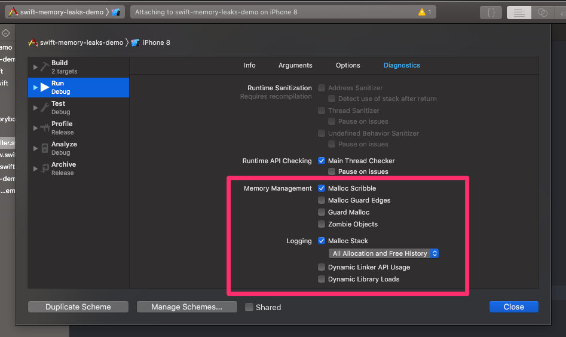
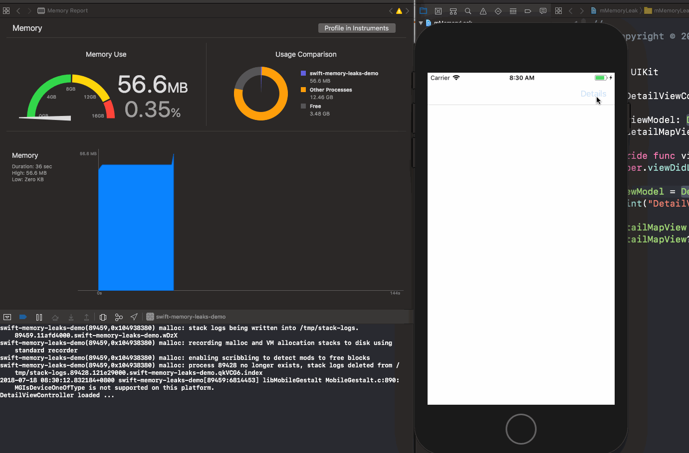
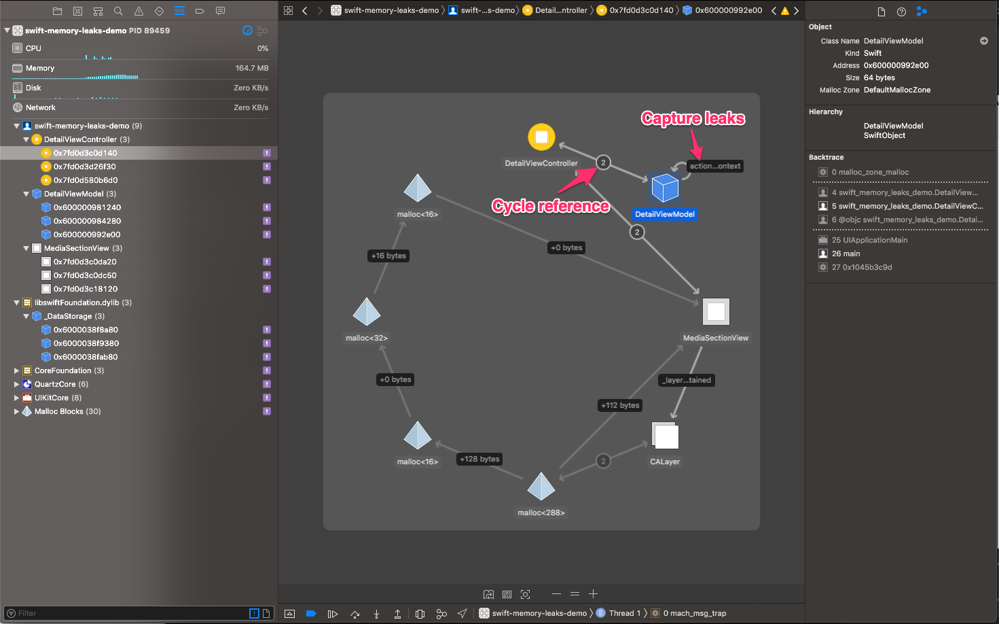
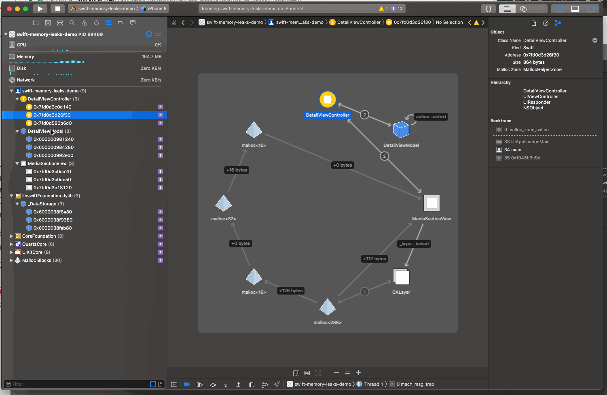

# Advanced Debug Swift Memory Leak


In 2016 WWDC Apple introduced two new Visual Debugging tools on Xcode in the [Session 410](https://medium.com/p/eb134b061158/edit). Here I want share a story how the Memory Graph Debugging make life easier on debugging memory leak issue.

### 0. Let’s get start it

1. Edit the scheme, and enable Debug Memory Graph
   
2. Open your app and play with it
3. Click the Debug Memory Graph button on Xcode, Then the memory graph will show up.
   


### 1. A story

In the real world, before we jump into debugging tools, when we get started to meet memory leaks problem.

**One day**, user complained that the app crash on getting into detail page sometimes. The app got bunch of crash report on Fabric as well.

We checked the log is like this below, and

```swift
Fatal Exception: NSMallocException
0 CoreFoundation 0x18503ed8c __exceptionPreprocess
1 libobjc.A.dylib 0x1841f85ec objc_exception_throw
2 Foundation 0x185a6ad7c _NSErrnoMessage
3 CoreFoundation 0x184f9dfd8 __CFSafelyReallocate
4 CoreFoundation 0x184fb99f8 __CFDataGrow
5 CoreFoundation 0x184f328b8 CFDataSetLength
6 CoreGraphics 0x186a237e0 CGDataProviderCopyData
7 AlamofireImage 0x103ed5e98 (Missing)
8 AlamofireImage 0x103ed1004 (Missing)
9 AlamofireImage 0x103ecdeb0 (Missing)
10 AlamofireImage 0x103eb26cc (Missing)
11 Alamofire 0x103cb7688 (Missing)
12 Alamofire 0x103c9a4c0 (Missing)
13 Foundation 0x185a66e88 __NSBLOCKOPERATION_IS_CALLING_OUT_TO_A_BLOCK__
......
```

**hmm…** It seems some wrong on **AlamofireImage**.

**Hand-on a minute…** **NSMallocException** would be a good indicator for memory issue.

We reproduced the crash with 20 times jump into detail screen from list screen. It looks fixable.

I created a demo here to demonstrate the memory issue:

<https://github.com/lvjian700/swift-memory-leaks-demo>

### 3. Checking the memory issue

Run the app from Xcode and play with Memory page. The you can see the memory keep growth up and never going down.



**Aha!** Memory leaks !!!


### 4. Debugging memory leaks

1. Edit project scheme, enable Debug Memory Graph
2. Re-run the app and play with it
3. Open the Debug Memory Graph on Xcode




Since Swift is ARC language. The major memory leaks issue is caused by **Cycle reference** and **Cycle capture**. You can see the two memory leaks on screenshot above. 

### 5. Fixing the memory leaks

Debug Memory Graph provide a very powerful way to identify which line of code has memory leak. See the picture below for using it:

1. Enable the filter for leak warning with purple icon in the navigator view
2. Check the object on memory graph
3. Check the code on inspector view, then jump into the code with click.




### 6. Try yourself

If you eager to try the Debug Memory Graph tool. Here is the demo, you can fix the memory issue with the tool.

<https://github.com/lvjian700/swift-memory-leaks-demo>

**Have a fun !**

