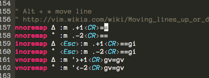

在使用IDEA时，可以用Alt+Command Up/Down 可以对代码进行上移/下移. 本文介绍如何在Vim中实现这个功能:



##在vimrc中加入如下配置

###For windows
```
nnoremap <A-j> :m .+1<CR>==
nnoremap <A-k> :m .-2<CR>==
inoremap <A-j> <Esc>:m .+1<CR>==gi
inoremap <A-k> <Esc>:m .-2<CR>==gi
vnoremap <A-j> :m '>+1<CR>gv=gv
vnoremap <A-k> :m '<-2<CR>gv=gv
```

###For Mac OS
```
nnoremap ∆ :m .+1<CR>==
nnoremap ˚ :m .-2<CR>==
inoremap ∆ <Esc>:m .+1<CR>==gi
inoremap ˚ <Esc>:m .-2<CR>==gi
vnoremap ∆ :m '>+1<CR>gv=gv
vnoremap ˚ :m '<-2<CR>gv=gv
```

##normal & insert mode

* Alt + k : 上移当前行
* Alt + j : 下移当前行

###visual mode

* Alt + k : 上移当前行或者选中行
* Alt + j : 下移当前行或者选中行

##参考
<http://vim.wikia.com/wiki/Moving_lines_up_or_down>